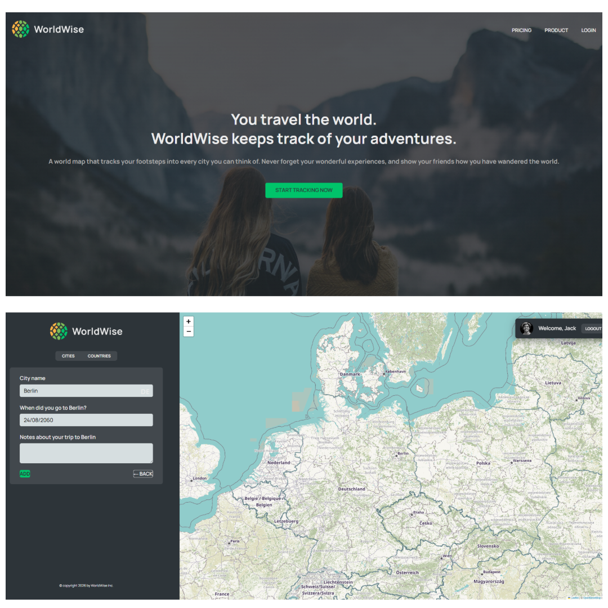

# 🌍 WorldWise — A Travel Tracking App

WorldWise is a **React-based travel tracking application** that allows users to record cities they have visited around the world, add notes for each location, and visualize them on an interactive map.

This project was built as a **hands-on learning project** to gain deeper experience with **React Router**, **Context API**, and modern React development patterns.

---

## 🚀 Live Demo

👉 **Live App:** _Coming soon_

---

## 🛠️ Tech Stack

- **React**
- **React Router**
- **Context API**
- **Vite**
- **JavaScript (ES6+)**
- **CSS**

---

## ✨ Key Features

- 🗺️ Interactive world map with city markers  
- 📍 Add visited cities with notes and visit dates  
- 🧭 Client-side routing using React Router  
- 🌐 Global state management using Context API  
- 🔐 Fake authentication flow (learning purposes only)  
- ⚡ Fast development setup powered by Vite  

---

## 📚 What I Learned

This project was primarily built to deeply understand **core React concepts**, especially:

### 🔀 React Router
- Nested routes  
- URL parameters  
- Programmatic navigation  

### 🌍 Context API
- Global state management  
- Avoiding prop drilling  
- Creating custom context providers  

### 🧩 Component Architecture
- Separation of concerns  
- Reusable components  
- Scalable folder structure  

### 🔄 Side Effects & Data Handling
- `useEffect`  
- Working with external data (JSON / mock APIs)  

---

### 👨‍💻 Author
**Fazl Rahmani**
- Github: https://github.com/rahmani-code
